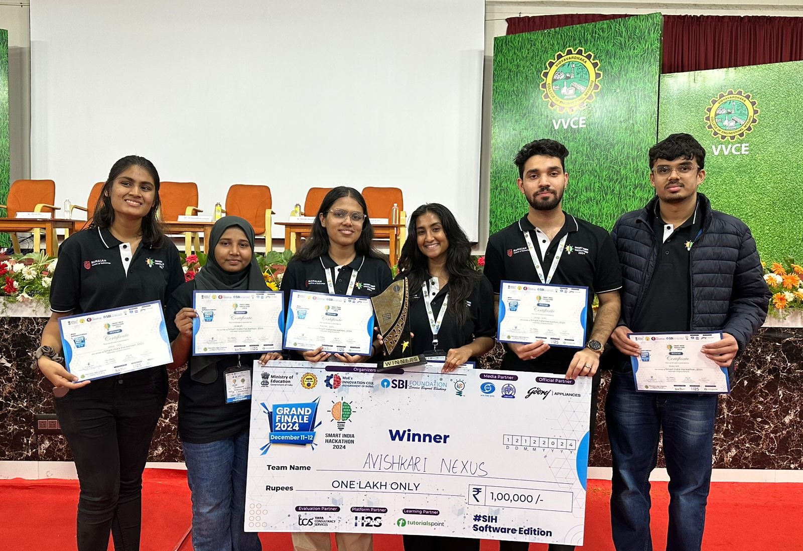

# 🌌 AsteroMiner AI – Smart India Hackathon 2024 Winner 🏆🚀  
**Identifying High-Value Asteroids for Space Mining Using Machine Learning**


## 🧠 Overview

**AsteroMiner AI** is an end-to-end ML-powered solution that identifies profitable asteroids for space mining. Developed for Smart India Hackathon 2024, it uses NASA’s Near-Earth Object (NEO) dataset (10L+ records) to:

- Classify asteroids as high- or low-value using machine learning  
- Visualize 3D asteroid parameters in real-time  
- Estimate mining revenue and recommend viable targets  


## 🏆 Achievements

- 🥇 **Winners – Smart India Hackathon 2024**
- 📈 Achieved **85% accuracy** with XGBoost classification  
- 🛰️ Real-time analytics and visualization of asteroid data  
- 💰 Revenue estimator and mission recommendations  


---

## 🧪 Machine Learning Approach

| Component           | Details                                      |
|--------------------|----------------------------------------------|
| Model              | XGBoost Classifier                           |
| Features           | Diameter, Velocity, Miss Distance, Orbit     |
| Dataset Size       | 10 Lakh+ records from NASA NEO               |
| Accuracy           | 85%                                           |
| Libraries          | Scikit-learn, Pandas, XGBoost, KDTree        |

---

## 🌐 Visualization & UI

- Frontend displays real-time analytics and asteroid insights  
- Graphs for velocity, distance, and mining value using Chart.js  
- Difficulty meter, ROI calculator, and prediction visualizer  

---

## 🔌 Tech Stack

| Area     | Technology                         |
|----------|-------------------------------------|
| Backend  | Flask (Python)                      |
| ML       | XGBoost, Scikit-learn, KDTree       |
| Frontend | HTML, CSS, JavaScript, Chart.js     |
| Dataset  | NASA NEO API and CSV datasets       |
| Hosting  | Localhost (Docker-ready)            |


## 🛠️ How to Run Locally

1. **Clone the Repository**

   ```bash
   git clone https://github.com/muskangoyal0606/SIH_2024.git
   cd SIH_2024
   ```

2. **Run the Backend**

   ```bash
   cd backend
   pip install -r requirements.txt
   python main.py
   ```

3. **Launch the Frontend**

   * Navigate to the `frontend/` folder.
   * Open `index.html` in your preferred web browser (e.g., Chrome or Firefox).


## 🚀 Future Enhancements

* Integrate live feed from NASA APIs
* Cloud deployment for public use
* GPU support for asteroid image analysis


## 🖼️ Winning Moment

> *Proud winners of Smart India Hackathon 2024 – Team Avishkati Nexus*




   

## 📬 Contact

**Muskan Goyal** – [Email](mailto:goyalmuskan0606@gmail.com)
GitHub: [github.com/muskangoyal0606](https://github.com/muskangoyal0606)


